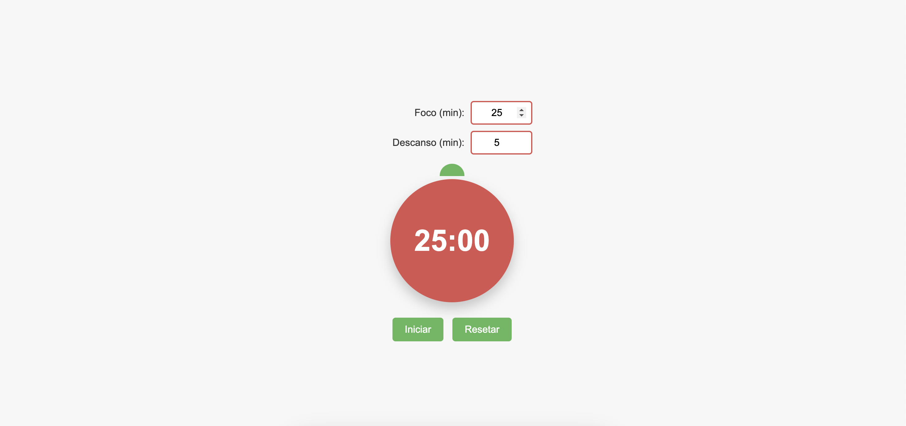

# 📝 Pomodoro Timer

O **Pomodoro Timer** é uma aplicação de cronômetro inspirada na técnica Pomodoro, ideal para melhorar a produtividade e a gestão do tempo. Com um design interativo e um tomate estilizado, a aplicação oferece uma forma visual e eficiente de gerenciar períodos de foco e descanso.

<p align="center">
  
</p>

## 🚀 Demonstração

Você pode ver a aplicação em funcionamento [aqui](https://digonexs.github.io/pomodoro-timer/).

## 📜 Como Usar

1. **Configuração Inicial**: Defina o tempo para o período de foco e o período de descanso nos campos de entrada fornecidos.
2. **Iniciar o Timer**: Clique no botão "Iniciar" para começar o período de foco. O temporizador de descanso iniciará automaticamente após o término.
3. **Controle do Timer**: Utilize os botões "Pausar" e "Resetar" para gerenciar o cronômetro conforme necessário.
4. **Mensagens de Erro**: Se os tempos informados forem menores que 5 minutos, uma mensagem será exibida informando o tempo mínimo necessário.

## 📋 Funcionalidades

- **Configuração de Temporizadores**: Defina dois temporizadores distintos para períodos de foco e descanso.
- **Controle de Temporizador**: Inicie, pause e resete o cronômetro conforme necessário.
- **Transição Automática**: O temporizador de descanso começa automaticamente após o término do período de foco.
- **Validações de Tempo**: Garante que o tempo mínimo para ambos os temporizadores seja de 5 minutos, exibindo mensagens de erro para valores inferiores.
- **Responsividade Completa**: Adapta-se a diferentes tamanhos de tela, desde dispositivos móveis até desktops maiores.
- **Compatibilidade de Navegadores**: Funciona nos principais navegadores: Google Chrome, Edge, Safari, Mozilla Firefox e Opera.

## 🛠️ Tecnologias Utilizadas

- **HTML**: Estrutura básica da página.
- **CSS**: Estilos para o layout responsivo.
- **JavaScript**: Funcionalidade da aplicação.

## 📂 Estrutura de Arquivos

```plaintext
.
├── index.html
├── styles.css
└── script.js
```

## 📦 Como Usar

Clone o repositório:

```bash
git clone https://github.com/digonexs/pomodoro-timer
```

Navegue até o diretório do projeto:

```bash
cd pomodoro-timer
```

Abra o arquivo index.html em seu navegador preferido.

## 👨‍💻 Contribuindo

Contribuições são bem-vindas! Sinta-se à vontade para abrir issues e enviar pull requests. Para mudanças maiores, abra uma issue primeiro para discutir o que você gostaria de mudar.

## 📝 Licença

Este projeto está licenciado sob a Licença MIT.

Feito com ❤️ por [Rodrigo](https://www.linkedin.com/in/rodrigocavalcantedebarros/).
